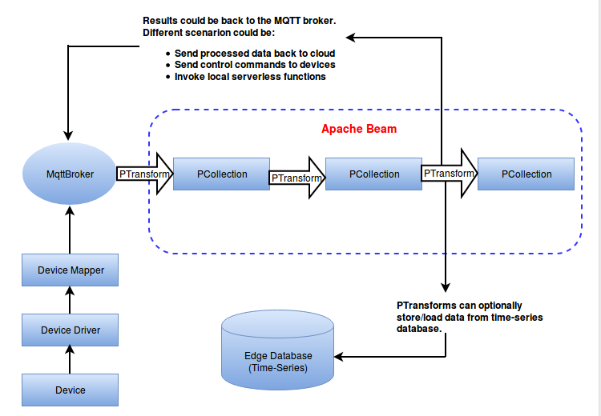
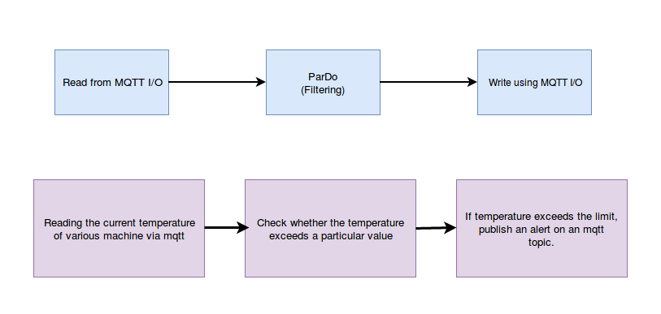
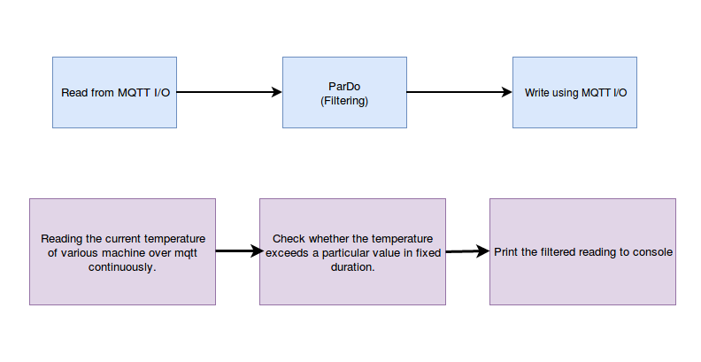

# Data Analytics @ Edge
## Description


The main aim of analytics engine is to get data from mqtt broker in stream format and apply rules on incoming data in real time and produce alert/action on mqtt broker. Getting data through pipeline and aplying analysis function is done by using apache beam.

###  Apache beam:
Apache Beam is an open source, unified model for defining both batch and streaming data-parallel processing pipelines. Using one of the open source Beam SDKs, wecan build a program that defines the pipeline.


#### Why use Apache Beam for analytics:
There are many frameworks like Hadoop, Spark, Flink, Google Cloud Dataflow, etc that came into existence. But there has been no unified API that binds all these frameworks and data sources, and provide an abstraction to the application logic from big data ecosystem. Apache Beam framework provides abstraction between your application logic and big data ecosystem. 
- A generic dataflow-based model for building an abstract pipeline which could be run on any runtime Flink/Samza etc.
- The same pipeline code can be executed on cloud(eg. With Huawei Cloud Stream based on Apache Flink), and on the edge with a custom backend which can efficiently schedule workloads in an edge cluster and perform distributed analytics.
- Apache Beam integrated well with TensorFlow for machine learning which is a key use-case for edge.
- Beam has support for most of the functions required for steam processing and analytics.
## Demo
#### Demo 1.1 [Real-time alert]:Read batch data from MQTT,filter and generate alerts
- Basic mqtt read/write support in Apache Beam for batch data
- Reads data from an mqtt topic
- Create Pcollection of read data and use it as the initial data for pipeline
- Do a filtering over the data
- PCollection and publish an alert on a topic if reading exceeds the value


#### Demo 1.2 [Filter Streaming Data]: Reads streaming data from MQTT, filter at regular intervals
- Read streaming data using MQTT
- Do a filtering over the data at fixed time intervals


### Prerequisite
- Golang
- KubeEdge
- Docker

### Steps to follow to deloy pipeline application on IEF cloud:
   For demo 1.1:
   Pull the docker image from dockerhub by using following command
    ```sh
    $ sudo docker pull containerise/ke_apache_beam:ke_apache_analysisv1.1
    ```
   For demo 1.2:
   Pull the docker image from dockerhub by using following command
   ```sh
   $ sudo docker pull containerise/ke_apache_beam:ke_apache_analysisv1.2
   ```
   Run the command
   ```sh
   $ docker images
   ```
   This will shows all images created. Check image named ke_apache_analysisv1.1 or ke_apache_analysisv1.2
    
    #### Open IEF console: [Huawei Cloud](https://console.huaweicloud.com/ief2.0/?region=cn-north-1#/app/dashboard)
    ##### Go to Edge Application
    - Create App Template
    - Upload image(eg. ke_apache_analysisv1.2). While uploading select 'upload image from     client' option. Follow the instruction given on dashboard to tag and push the image.
    - Create
	
	##### Go to app deployment(IEF)
	- Select your node(make sure that node is in running state)
	- Select app template(docker image)
	- Create
	
    To check app running or not:
     ```sh
    $ docker ps -a -n2
    ```
    It will list cotainers which are in running state.
    To che
    ```sh
    $ docker logs id_of_running_container
    ```
    This will show log of your container.
    To check result, publish dummy data by using [testmachine](MQTT_Publisher/testmachine.go)
    run:
     ```sh
    $ go build testmachine.go
    $ ./testmachine
    ```
    

